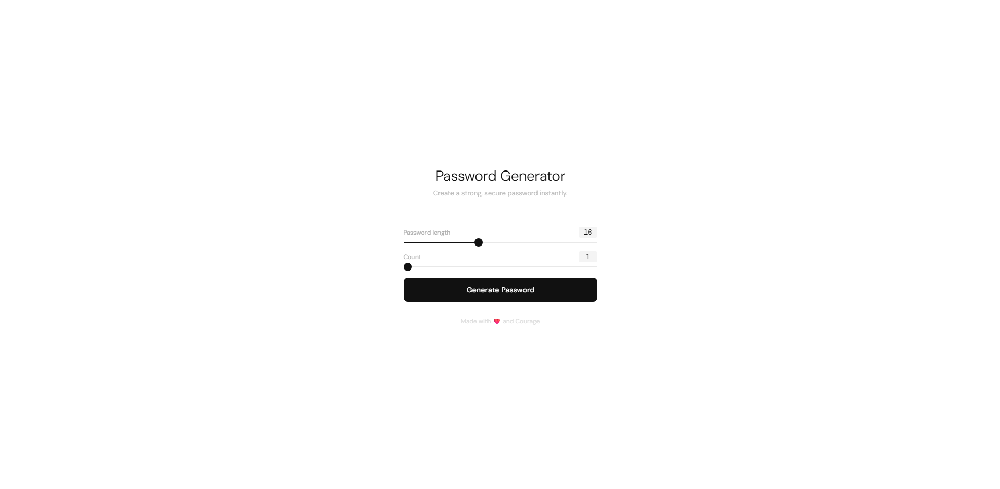
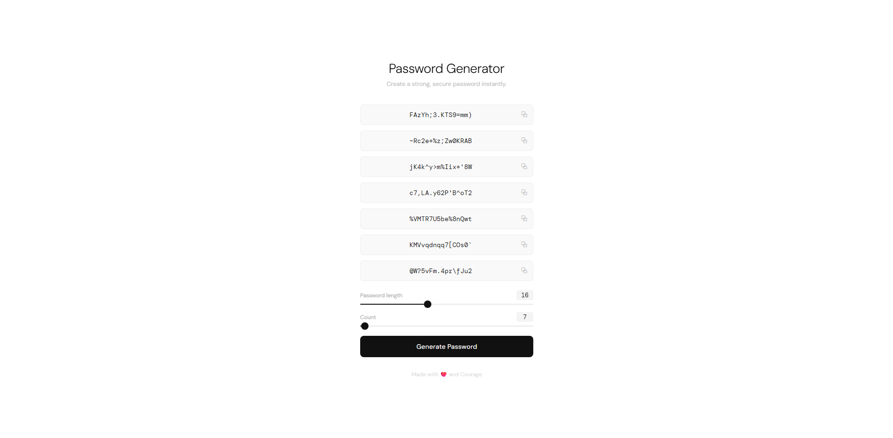

# 🔐 Password Generator

A clean, animated password generator with a minimal frontend and a simple backend API.

---

## Screenshots


*Before generating — clean default view*


*After generating — multiple passwords with copy buttons*

---

## Features

- Generate one or multiple passwords at once
- Adjustable password length (6–32 characters)
- Character scramble animation on reveal
- Click any password to copy it to clipboard
- Ripple button effect and staggered card animations
- Fully responsive, no dependencies

---

## Project Structure

```
├── app.py                 # Flask backend (API routes)
└── templates/
    └── index.html         # Frontend UI (HTML/CSS/JS)
```

---

## How It Works

The frontend sends a `GET` request to your backend:

```
GET /api/batch/generate?length=16&count=3
```

The backend responds with JSON:

```json
{
  "passwords": ["aB3$kL9!", "xZ2#mQ7@", "pR8!nW4#"]
}
```

The frontend then renders each password with a scramble animation and makes them click-to-copy.

---

## API Reference

### `GET /api/batch/generate`

| Parameter | Type   | Default | Description                        |
|-----------|--------|---------|------------------------------------|
| `length`  | number | `16`    | Length of each generated password  |
| `count`   | number | `1`     | Number of passwords to generate    |

**Response**

```json
{
  "passwords": ["string", "string", "..."]
}
```

---

## Getting Started

1. Install Flask:
   ```bash
   pip install flask
   ```
2. Run the app:
   ```bash
   python app.py
   ```
3. Open `http://localhost:5000` in your browser

---

## Animations

| Animation | Trigger |
|-----------|---------|
| Scramble reveal | After passwords load |
| Staggered slide-in | Each card enters with a delay |
| Button ripple | On click |
| Slider bump | When dragging the sliders |
| Copy flash | On clicking a password card |

---

## Tech Stack

- **Backend**: Python + Flask
- **Frontend**: Vanilla HTML, CSS, JavaScript — no frameworks
- [DM Sans](https://fonts.google.com/specimen/DM+Sans) + [DM Mono](https://fonts.google.com/specimen/DM+Mono) (Google Fonts)
- Browser Clipboard API for copy-to-clipboard

---

Made with ❤️ and Courage